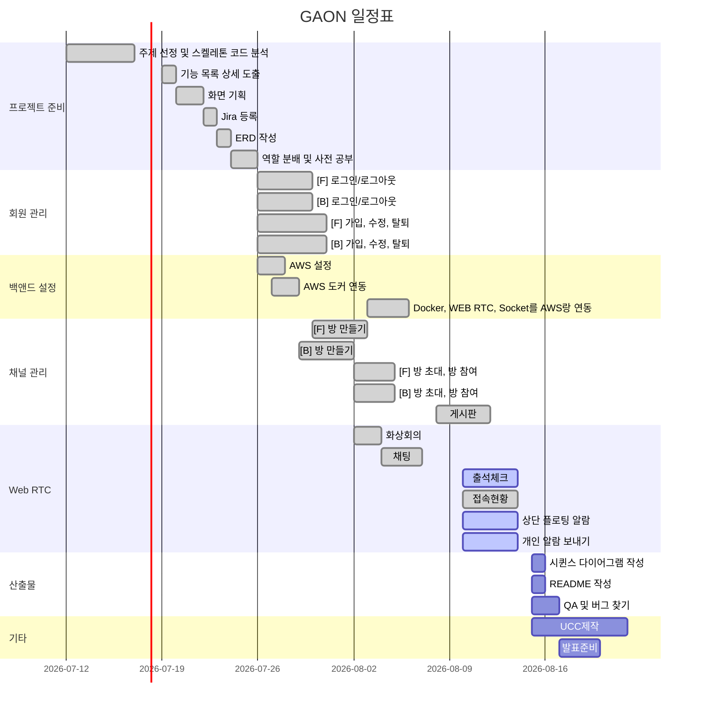

# GAON 가온 : (Gather As One Network)
---
**삼성 청년 SW 아카데미 2학기 공통 프로젝트**

---

- **프로젝트 설명**
    - **대상** : 학생 & 선생님 ( 교육 , 학습용 )
    - **배경** : 코로나가 길어지고 온라인 수업이 많아지고 있다.
    - **문제점**

        기존의 플랫폼들은 단순 `화상회의`만을 위한 플랫폼이지 수업을 위한 플랫폼이 아니다.

        그래서 다음과 같은 문제들이 발생한다.

         1. 웹액스, 구글미트 등의 대부분의 화상회의 플랫폼은 학생이 방에 접속하려면 링크를 눌러야한 한다. 즉 매일 접속해야하는 수업이더라도 해당 링크를 매일 눌러주어야 참여할 수 있다.

        1. 선생님이 출석 체크를 따로 해야한다. 수업용 플랫폼이 아니기 때문에 출석체크 기능이 존재하지 않는다.
        2. 과제 제출을 위해 다른 플랫폼을 추가로 사용해야 한다. 
        - 이와 같은 문제들로 대부분의 온라인 수업에서 `화상미팅 프로그램` `과제 제출용 플랫폼` `카카오톡, mattermost 등 소통용 플랫폼` 등 여러 플랫폼을 동시에 사용하고 있다.

    ⇒  **해결책**

    화상수업, 과제제출, 출석체크 + 다양한 부가기능 등의  `수업을 위한 기능`을 `한번에` 제공하는 웹 사이트를 제공하자!

---

- **사용 기술**
    - **Front-end**

         Vue.js

         Element-plus

    - **Back-end**

        Spring Boot

        JPA + Quserydsl

        Swagger

        MySql

    - **기타**

        Docker Compose

        OpenVidu

        AWS

---

- **기능 상세 설명**

    **회원 관리**

    1. 구글 로그인/로그아웃
    2. 회원관리 (가입 수정 삭제)

    **방 기능**

    1. 파일 자료 공유 ( 게시판 )
    2. 출석 확인

    **방 관리**

    1. 방 만들기
    2. 초대기능(카톡공유, url or 코드)
    3. 방 참여 
    4. 방 정보 수정

    **회의 관리**

    1. 화상회의 - 기본app 최하단 display

         (게시판 등 다른 기능이랑 동시에 사용 가능해야함)

    2. 채팅 (채팅에서 파일 공유)

    **회의 부가 기능**

    1. 개인알람 보내기
    2. 출석체크 (출석부란, 수동체크 → 현재 미접속인 애들 자동체크되어있다) 좀 편하게 
    3. 접속현황 : 현재 미접속인 애들, 접속인애들 분리해서 보여주기
    4. 상단에 플로팅알람 띄우기 (플로팅에 타이머도) (ex 발표할때 시간넘으면 컷트)

---

- **DB ERD**

   

---

### 화면정의서
 
[화면정의서.pdf](https://github.com/co323co/GAON/files/7077303/default.pdf)

---
## 일정표

## ERD 

 

## 목차

- [프로젝트 소개](#프로젝트-소개)   
- [텍스트 ... ](#프로젝트-소개)   
- [프로젝트 명세](#프로젝트-명세)
  - [배포 환경](#배포-환경)
  - [개발 환경](#개발-환경)
  - [Design Resources](#design-resources)
  - [핵심 라이브러리](#핵심-라이브러리)
 

## 프로젝트 소개
소개 입력
 

## 프로젝트 명세
### 배포 환경
- __URL__ : 
- __배포 여부__ : O / X
- __접속 가능__ : 접속 가능 / 수정 중
- __HTTPS 적용__ : O / X
- __PORT__ : // 3rd Party에서 사용하는 포트가 있다면 기입해주세요. <- 기입 후 해당 주석 삭제
 

### 개발 환경
#### Front-end / Android
- __Framework__ : Vue.js / React / Android / Unity
- __지원 환경__ : Web / Mobile / Web App / Native App
- __담당자__ : 팀원 A, 팀원 B,
 

#### Back-end
- __Framework__ : Spring boot / Node.js / Django / Flask
- __Database__ : MySQL / MariaDB
- __담당자__ : 팀원 A, 팀원 B,
 

#### Design
- __Framework 사용__ : O / X
  - [Vuetify](https://vuetifyjs.com/)
  - [Element Plus](https://element-plus.org/)
- __Design Tool 사용__ : Adobe XD, Photoshop, Blender, Zeplin 등 (없을 경우 빈칸)
- __담당자__ : 팀원 A, 팀원 B,
 

### Design Resources
__외부 템플릿 또는 에셋__ (이미지 또는 링크 첨부)
- 무료 이미지, 아이콘, 폰트 등은 제외
- [Vue Argon Design System](https://www.creative-tim.com/product/vue-argon-design-system?affiliate_id=116187) (무료)
  - __사용 기능__ : 디자인 전반 적용
- [Vue Black Dashboard Pro](https://www.creative-tim.com/product/vue-black-dashboard-pro?affiliate_id=116187) (유료)
  - __사용 기능__ : 캘린더 컴포넌트 사용
 

__자체 제작 산출물__ (필요시 이미지 또는 설명 첨부)
- LOGO
- CardView
- Button
- Calendar
 

### 핵심 라이브러리
기본 제공하는 라이브러리 외 핵심 기능 구현에 사용한 라이브러리가 있다면 작성해주세요.   
예시 ) VR/AR 라이브러리, 애니메이션 라이브러리, 텍스트/사진/동영상 지원, 편집 라이브러리 등

- __AR CORE__
  - __링크__ : https://developers.google.com/ar
  - __소개__ : 구글에서 제공하는 AR 지원 라이브러리
  - __사용 기능__ : 이미지 인식, 이미지 위 영상 표시
  - __담당자__ : 팀원 A, 

- __COLOR THIEF__
  - __링크__ : https://lokeshdhakar.com/projects/color-thief/
  - __소개__ : 이미지에서 색상을 추출해주는 라이브러리
  - __사용 기능__ : 커버 사진에서 색상 추출 -> 배경 색상 변경
  - __담당자__ : 팀원 A,

- __Animate.css__
  - __링크__ : https://animate.style/
  - __소개__ : css 애니메이션 지원 라이브러리
  - __사용 기능__ : 메인 페이지 진입 시 애니메이션 사용
  - __담당자__ : 팀원 A,,

